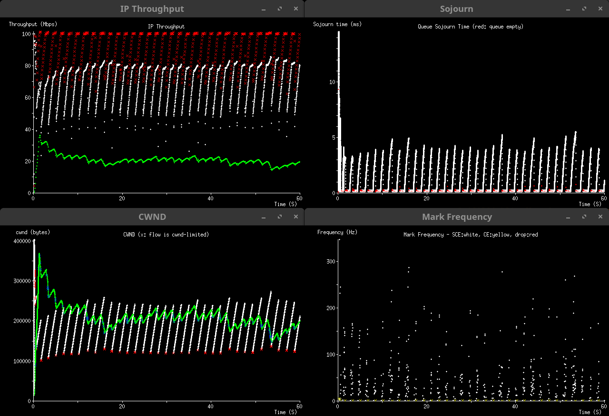

<!--
SPDX-License-Identifier: GPL-3.0-or-later
Copyright 2024 Pete Heist
-->

# Multiplicative Decrease Scaling

Pete Heist 
October 18, 2024 - April 16, 2025

## Abstract

Multiplicative Decrease Scaling (MDS or MD-Scaling) provides high-fidelity
Explicit Congestion Notification (ECN) in a way that's compatible with
conventional congestion control algorithms (CCAs) in a single queue.  Using a
signaling and response [relationship](#mds-signaling-relationship) that allows
cwnd convergence with conventional CCAs, MDS aims to reduce queueing delay, and
increase utilization for MDS CCAs, while supporting the transition to scalable
CCAs.  MDS's compatibility with conventional TCP traffic allows flexibility in
middlebox deployments, from simple, single-queue or policer designs, to
dual-queue with a low-latency queue, to full Fair Queueing, where there is no
danger of flow domination even on flow hash collisions.

This document explores MDS as a step towards an Internet Draft.  First, we
present some background and motivation for the work.  Next, we outline the
design requirements for MDS Active Queue Management (AQM) and CCAs.  Finally, we
test MDS through simulation.

## Background, Motivation and Rationale

[RFC3168](https://datatracker.ietf.org/doc/rfc3168/) allows Active Queue
Management (AQM) to mark instead of drop packets, indicating congestion before a
queue is full.  This reduces packet loss, preventing retransmission delays and
service degredation.

However, in order to retain compatibility with pre-RFC3168 congestion
controllers, the normal response to either an RFC3168 CE mark or a drop is the
same- that is, a coarse 0.5 multiplicative decrease (MD) to cwnd (0.7 for CUBIC)
up to once per RTT1.  Thus, while RFC3168 AQMs can reduce queueing
delay by signaling congestion early, they can also reduce utilization when
coarse MDs cause cwnd to drop below BDP.

Experiments with DCTCP
([RFC5287](https://datatracker.ietf.org/doc/rfc8257/)) and 
L4S ([RFC9330](https://datatracker.ietf.org/doc/rfc9330/)) have shown that by
sending CE signals earlier and more frequently, and by using a smaller response
at the sender than conventional CCAs, we can reduce queueing delays and increase
utilization, improving the value of ECN.  We refer to this generally as
high-fidelity ECN.  However, DCTCP is not compatible with conventional CCAs in a
single queue, so either it must not be deployed on the Internet, or DCTCP
traffic must a placed in a separate queue, as is the case for the L4S
[Dual-Queue Coupled AQM](https://datatracker.ietf.org/doc/rfc9332/).

Single-queue AQMs are less complex and costly to deploy than their multi-queue
counterparts.  Furthermore, compatibility with conventional TCP traffic in a
single queue has value beyond just single-queue AQMs.  Dual-queue designs are
free to either separate MDS from conventional traffic, or to place *only* sparse
flows in a low-latency queue, which would protect them from the "train wreck
effect" on rate drops.  So, we seek a design for high-fidelity ECN, using
single-queue AQMs and supporting CCAs, that remains compatible with conventional
CCAs so it can be deployed safely on the Internet.

When traffic shares one queue, conventional CCAs will both impact the queueing
delay of, and have their utilization impacted by early-marking AQMs.  For
single-queue AQMs, we hypothesize that there exists a level of queueing delay
that is "good enough" both for delay-sensitive applications, and conventional
flow utilization, making single-queue high-fidelity ECN marking sensible to
deploy2.  We note that:

* A single Reno flow that receives CE marks or drops as soon as congestion
  starts will at worst get 75% of full utilization, over time.  A single CUBIC
  flow, with its growth function and standard *βCUBIC* of 0.7, will
  typically get higher utilization than that.
* As the number of flows increases, so does the utilization.
* In many environments, traffic arrives at queues in bursts that are difficult
  if not impossible to control.  802.11ac/ax aggregates can be up to 5.5 ms in
  duration.  Allowing this level of queueing delay when it's useful for burst
  tolerance anyway can improve the utilization of conventional flows,
  particularly at low RTTs.
* As bandwidths increase over time:
  * Minimizing delay becomes more important than maximizing the utilization of
    conventional flows, as the impact of reduced utilization becomes less
    noticeable to the user, while the impact of queueing delay remains the same.
  * Conventional CCAs will need to be replaced with scalable CCAs.  This is
    well known for Reno, but there is also a
    [scalability limit for CUBIC](#cubics-scalability-limit)).  CCAs with
    scalable cwnd growth functions, like
    [Scalable TCP](https://en.wikipedia.org/wiki/Scalable_TCP), tend to prefer
    shorter queues, both for stability, and for reasonable fairness with
    conventional CCAs.  MDS AQMs support this by aiming to keep queueing delay
    within some allowable burst.

1 The
[TCP Alternative Backoff with ECN (ABE)](https://datatracker.ietf.org/doc/rfc8511/)
experiment allows a somewhat finer response to CE, up to an MD of 0.85.  For
simplicity, we do not use ABE in this writeup, though it could be used for
experiments with MDS.

2 Some sharp increases in queueing delay, for example due to large
bursts or bottleneck rate drops, are impossible to control without dropping
packets.  In these cases, the only way to protect highly delay-sensitive sparse
flows, without dropping packets, is to place them into a separate queue with
priority scheduling.

## Design Requirements

MDS requires:

* Senders to negotiate MDS support with receivers
* An IP-layer identifier on all MDS traffic
* An ECN codepoint for a congestion signal
* AQMs and senders that signal and respond using the
  [MDS signaling relationship](#mds-signaling-relationship)
* Receivers to [reflect](#receiver-feedback) congestion signals back to senders

MDS does **not** require:

* Queue separation from conventional traffic, as the MDS signaling relationship
  allows MDS and conventional traffic to share the same queue
* [AccECN](https://datatracker.ietf.org/doc/draft-ietf-tcpm-accurate-ecn/), as
  the loss of any of the frequently-sent congestion signals is recovered from
  naturally by the control loop

### Negotiation and Signaling Semantics

MDS uses
[Some Congestion Experienced (SCE)](https://datatracker.ietf.org/doc/draft-morton-tsvwg-sce/)
signaling with some additions, meaning:

* A TCP option for MDS capability negotiation
* A DSCP as an IP-layer MDS identifier
* ECT(1) as the high-fidelity MDS congestion signal, as permitted by
  [RFC8311](https://datatracker.ietf.org/doc/rfc8311/) 3
* The former NS TCP flag (anticipated AE flag) for congestion feedback
  4
* Optional: CE as the RFC3168, drop-equivalent congestion signal

3 ECT(1) is hereafter referred to as SCE when it's used as the
high-fidelity congestion signal.

4 NS/AE is hereafter referred to as ESCE when it's used for
high-fidelity congestion feedback.

> [!NOTE]
> A pending update to the SCE draft will specify the TCP option negotiation
> process, and provide further updates on the usage of DSCP.

#### L4S Compatibility

Note that the ECT(1) codepoint would then be shared by both the MDS signal and
the L4S identifier, however, no harm is anticipated for the L4S experiment
because:

* L4S traffic would perform in MDS AQMs as they would in any RFC3168-style AQM
  that recognizes ECT(1) as the L4S identifier.  If an MDS AQM needs to mark an
  L4S packet with CE, it would drop instead.
* MDS traffic will not harm L4S queues.  It goes into the C queue, and if it's
  ECN-capable, any CE marked packets go into the L queue, as happens with any
  ECN-capable packets.
* Issues with subsequent bottlenecks are unlikely to occur often, as there's
  usually only one bottleneck on a path at a given time, however, the following
  may occur occasionally, none of which harms L4S:
  * If an MDS bottleneck is before an L4S bottleneck, there may be more
    reordering for MDS flows, as MDS packets may be marked ECT(1) or not, then
    alternately placed in the C and L queues.  L4S bottlenecks could be modified
    to always place MDS traffic in the C queue, but this is not required.
  * Since L4S traffic loses its identifier when it's marked CE, MDS bottlenecks
    that wish to CE mark an L4S packet that was already marked CE upstream would
    not know to drop the packet instead of leaving the existing mark.  This
    could lead to an L4S flow getting more capacity than it would otherwise.
  * MDS packets marked ECT(1) at an MDS bottleneck, then DSCP-bleached, then
    arriving at a second MDS bottleneck, would be treated as an L4S packet.
    This is safe, but may lead to a small number of unnecessary drops for MDS
    packets.
* There is no problem anticipated with overloading the AE flag in TCP, since MDS
  support is negotiated separately from AccECN.

#### Signaling Traversal

MDS will not work in some networks at first due to DSCP bleaching and TCP
option clearing, however it falls back safely in the presence of either.  If the
TCP option is cleared, MDS will not be negotiated and the sender will act as a
conventional sender, ECN-capable or not.  If the DSCP is bleached before a
bottleneck, the AQM will treat packets as conventional traffic, and the response
is safe and compatible.  If the DSCP is bleached after a bottleneck, MDS still
works in full.  The emphasis is on robustness, and network operators can allow
the DSCP and TCP option, if they don't already, as they become familiar with the
benefits.

### MDS Signaling Relationship

Given the following definitions:

* *β*: the MD on a drop or CE mark (typ. 0.5), used by both conventional and MDS
  CCAs
* *τ*: a chosen MD-scaling constant (see [Choosing τ](#choosing-τ))
* *βmds*: the scaled MD on SCE, used by MDS CCAs
* *Psce*: the AQM's probability of an SCE marking opportunity (that a
  packet will be marked SCE, iff the packet carries the MDS identifier)
  5
* *Pdrop*: the AQM's probability of a drop or CE marking opportunity
  (that a packet will be dropped or marked CE, iff the packet does **not** carry
  the MDS identifier) 5

5 Probability may be substituted with frequency, e.g. with
time-domain AQMs.

The MD-Scaling relationship must be used in both the CCA and the AQM.

In the CCA:

$β_\text{mds} = β^{(1/τ)}$

In the AQM:

$P_\text{sce} = τ * P_\text{drop}$

Summary:

> If an MDS AQM signals with τ SCE marking opportunities for every CE/drop
> opportunity, and conventional CCAs respond to ECE/drop with an MD of β, while
> MDS CCAs respond to each acked segment with the ESCE flag set with an MD of
> $β^{(1/τ)}$, then MDS CCAs will respond equivalently over time to conventional
> CCAs, even as they respond more frequently.
>
> If the MDS CCA additionally uses Reno-linear growth, its cwnd will converge
> with that of conventional Reno flows.

### Choosing τ

The value of τ is fixed for a given MDS identifier.  Table 1 shows some of the
effects of increasing τ, with the opposite effects on decreasing τ.

| Characteristic                                             | Change   |
| -----------------------------------------------------------|----------|
| Response sawtooth                                          | Smaller  |
| Delay variation                                            | Decrease |
| Utilization                                                | Increase |
| Effectiveness at low packet rates, low RTTs and high loads | Decrease |
| cwnd response/convergence speed 6               | Decrease |

*Table 1: General effects of increasing τ independently*

6 Note that cwnd response/convergence speed is affected by both the
choice of τ and the packet rate.  At higher packet rates, congestion signals can
be sent more often, approaching response times at lower values of τ.  However, a
lower τ always allows a faster response.

Figure 1 shows that as τ increases, the per-signal reduction in cwnd drops
rapidly.  At τ=32, the reduction is 2.14%.  At τ=64, the reduction is 1.08%.
Values of 32 or 64 appear reasonable in simulation.  The final choice for τ
requires further study.

*Figure 1: cwnd reduction on SCE signal vs τ*

### Active Queue Management (AQM) Guidelines

MDS AQMs must adhere to the
[MDS signaling relationship](#mds-signaling-relationship).  This is the only
hard requirement.

MDS AQMs should:

* Aim to keep the queueing delay within some allowable burst, regardless of load
* Aim to minimize the queueing delay, when actual bursts are smaller
* Avoid underutilization

At sufficiently low packet rates, low RTTs, high loads, or high τ, it's not
possible to control the queue even if every packet is marked SCE.  In such
cases, MDS packets may be dropped or marked CE instead, preferably while
maintaining the MDS signaling relationship.  The
[DelTiM AQM](deltim-aqm-a-deltic-variant) shows this to be possible.

### Congestion Control Algorithm (CCA) Guidelines

MDS CCAs must:

* Respond to SCE marks using the MDS signaling relationship
* Operate effectively when not in an MDS bottleneck

MDS CCAs should:

* Avoid excessive harm to conventional traffic (see also [Fairness](#fairness))
* Have a Reno-friendly region at suitably low cwnd where a Reno-compatible
  growth function is used
* Avoid inducing delay spikes beyond some burst duration, even as RTT increases

MDS CCAs may:

* Limit their response to τ SCE marks per RTT, for parity with conventional CCAs
* Use a scalable growth function outside the Reno-friendly region, which may
  cause some throughput harm to conventional flows
* Use a scalable growth function inside the Reno-friendly region, which may
  yield some capacity to conventional flows in exchange for less aggressive
  growth at low RTTs

### Receiver Feedback

MDS receivers that accept the MDS capability negotiation must reflect SCE marks
back to senders.  For TCP, there are two suggested approaches:

* *Immediate ACKs*: send an ACK for every segment, with the ESCE flag reflecting
  the state of the incoming SCE codepoint.
* *State-change ACKs*: immediately flush any pending ACKs up to the previous
  segment when the state of the incoming SCE codepoint changes.

Immediate ACKs are easier to implement and can be useful for experimentation,
but they increase traffic on the ACK path.  State-change ACKs allow consecutive
packets with the same SCE state to be coalesced by the normal delayed ACK logic,
inflating the ACK volume only slightly compared to an unmarked flow.  Both
approaches ensure that the proportion of ESCE-flagged acked segments reflects
the proportion of SCE-marked packets.

## Test Implementation

### Simulation

For these simulations, we used [scim](https://github.com/heistp/scim), a basic
discrete event simulator for congestion control testing that was written for
educational purposes, and for quickly evaluating ideas.  As with any simulation,
results may not reflect what happens in the real world.  However, we expect that
it's useful enough for verifying that the MD-Scaling signaling relationship
works, and approximating performance under some conditions.

Several aspects of this simulation are different from what's typical in reality:

* There is no handling of packet loss, only explicit ECN and MDS congestion
  signaling.
* Delayed ACKs are disabled.7
* cwnd is in bytes, not segments.
* There is no simulation of offloads, so the AQM sees 1500 byte packets instead
  of the usual aggregates.
* There's a single queue for interface and device, and no concept of a socket
  buffer.

7 This was done to simplify development and testing.
[State-change ACKs](#receiver-feedback) were not implemented at the time of this
writeup.

#### Test Configuration

All tests use:

* A τ of 64.
* AQMs and CCAs as described under
  [AQM and CCA Implementations](#aqm-and-cca-implementations), notably:
  * The DelTiM AQM with a burst of 5 ms.
  * Scalable TCP with a=1/200, b=0.5, and lwnd=250 kB.
* Paced flows, with
  [Extended Slow Start With Pacing](#extended-slow-start-with-pacing) (ESSP)
  for slow-start.
* An IW of 10.
* An MTU of 1500 and an MSS of 1448.

#### Test Plots

* In the sojourn time plots:
  * Red means a packet was dequeued, but the queue became empty after the
    dequeue.  So, a stretch of red doesn't mean there were no packets in the
    queue at all, but that single packets were being enqueued and dequeued.
  * The plotted time includes the packet serialization time, e.g. 120 µs for 100
    Mbps, or 12 µs for 1 Gbps.
* In the cwnd plots, values are plotted with an X in a different color when the
  flow was cwnd limited.
* In the mark frequency plots, SCE frequency is plotted with a white dot, CE
  with a yellow X, and drop with a red X.  Since there is no drop support yet in
  the simulator, packets are instead marked with a CE mark, but that indicates
  when an AQM *would* drop.

### AQM and CCA Implementations

#### DelTiM AQM (a DelTiC variant)

The [DelTiC](https://github.com/chromi/sce/blob/sce/net/sched/sch_deltic.c)
(Delay Time Control) AQM is a time-domain AQM based on a delta-sigma control
loop, derived from PID control theory.  DelTiC's main configuration parameter is
a target delay, used as the controller's setpoint.  The error, or the difference
between the sojourn time and the target, is used to adjust the controller's
output, a marking frequency, such that the error is minimized over time.

The DelTi**M** (Delay Time Minimization) AQM tested here is an experimental
variant of DelTiC that effectively has a fixed setpoint of one packet in the
queue, and uses queue idle (empty) time to scale down the marking frequency.  It
is configured only with a `burst` parameter, which is not a hard limit on the
sojourn time, but controls the AQM's response to be appropriate for bursts up to
the given duration.  A lower value for `burst` will generally reduce sojourn
time at the possible expense of utilization.

The MDS variants of DelTiC and DelTiM use two numerical oscillators linked by
the MDS signaling relationship, one for marking MDS traffic, and one for marking
conventional and RFC3168 traffic.  If the SCE marking frequency exceeds the
packet frequency, MDS packets are marked CE, and the MDS oscillator's marking
credit is scaled up by τ, to maintain the signaling relationship.  Either
oscillator drops packets if the CE marking frequency exceeds the packet marking
frequency.

#### Reno-MDS CCA

The growth function and response to CE or drop for Reno-MDS is the same as it is
for conventional Reno.  On ESCE, we perform an MD of $β^{(1/τ)}$ per the
MD-Scaling signaling relationship, iff:

* It is at least one srtt since the last CE/drop.
* We have not already responded to τ SCE marks within the last srtt (implemented
  using a ring buffer of SCE response times).

Reno-MDS works identically to Reno when outside of an MDS bottleneck.

#### CUBIC-MDS CCA

The growth function and response to CE or drop for CUBIC-MDS is the same as it
is for conventional CUBIC.  We use the default C of 0.4, with fast convergence
enabled.  On ESCE, we respond as does Reno-MDS, except:

* β is taken to be βcubic, or 0.7, so the MD is $0.7^{(1/τ)}$.
* We make relevant state updates also performed in the response to CE/drop, i.e.
  we update Wmax, tepoch, cwndepoch and
  West.

CUBIC-MDS works identically to CUBIC when outside of an MDS bottleneck.

#### Scalable-MDS CCA

As described in
[Scalable TCP: Improving Performance in Highspeed Wide Area Networks](https://datatag.web.cern.ch/papers/pfldnet2003-ctk.pdf),
Scalable TCP's growth function is rate-independent, and its recovery time is
solely a function of the RTT and the value of its `a` parameter.  The growth
function is the same for Scalable-MDS as it is for Scalable8.  To
improve fairness with conventional flows, we use an `a` of 1/200, reducing
aggressiveness compared to the paper's suggested value of 1/100.  Because the
simulation's cwnd is in bytes, we grow it by 1 byte for every 200 acked bytes,
instead of growing in units of segments.

When responding to a CE mark, we use an MD of 0.5, instead of the paper's
suggested 0.875 (a `b` value of 0.125).  This improves fairness with
conventional flows, and in our case, we have MDS for a finer response.

We respond to SCE as does Reno-MDS.  Since we use a β of 0.5, and we can respond
up to τ times per RTT, it allows for a faster response than would the paper's
suggested MD of 0.875, once per RTT.

We use an lwnd (legacy window size) of 250 kB.  Below this level, Reno-linear
growth is used, and above it, Scalable growth is used.

Scalable-MDS works identically to Scalable with our chosen parameters when
outside of an MDS bottleneck.

8 Since Scalable uses greater than additive growth, we need to be
aware of stability.  There are stability criteria in Section 3.4 of the
referenced Scalable paper which have not yet been re-evaluated for Scalable-MDS.
However, for stability, and for fairness with conventional flows, keeping queues
short is helpful, and that is what MDS AQMs like DelTiM are designed to do.

#### Slow Start and Extended Slow Start With Pacing

TCP slow start is a significant source of queueing delay from the sender.  With
its aggressive growth, which traditionally doesn't stop until loss occurs, it
can cause queueing delay spikes, which worsen as the RTT increases.  Slow start
can also exit early, particularly with short queues or early marking AQMs.

[Extended Slow Start With Pacing](https://github.com/heistp/essp/) (ESSP) is an
experimental replacement for conventional slow start that advances through
multiple stages until it converges at the correct cwnd, using appropriate pacing
scale factors at each stage for efficient operation.  It reduces peak delays,
and ensures that at slow start exit, the flow has reached an appropriate share
of capacity, or the BDP of the path if it's the only flow in the bottleneck.

We do not focus on analyzing the effects of slow start or ESSP in these tests
except for the occasional remark.  ESSP is used in all tests so that flows more
consistently reach their available capacity before proceeding to congestion
avoidance.

## Tests

> [!IMPORTANT]
> Please read the [Simulation](#simulation) section before interpreting these
> results.

### Reno Without and With MD-Scaling

Figure 2 shows the sawtooth of a conventional Reno flow, with the associated
underutilization and periodic delay spikes.  Figures 3a and 3b show a Reno-MDS
flow, with a finer sawtooth, close to full utilization and steady-state queueing
delay below 1 ms.  We also see in Figure 3a vs Figure 2 that the Reno-MDS flow
has a shorter peak and duration of delay during slow start, as it takes
advantage of the earlier signaling.

Note that the stretches of red in the sojourn time plot just mean that the queue
became empty after a dequeue.  See [Test Plots](#test-plots).

*Figure 2: Conventional Reno sawtooth, 100 Mbps, 40 ms path RTT*

---

*Figure 3a: Reno-MDS finer sawtooth, 100 Mbps, 40 ms path RTT*

---

*Figure 3b: Reno-MDS finer sawtooth, zoomed*

### Reno-MDS Mixed RTT Flow Competition

Figure 4 shows competition between two Reno-MDS flows with different path RTTs.
Like conventional Reno flows, Reno-MDS flows converge to equal cwnd, not equal
throughput.

*Figure 4: Two Reno-MDS flows with 20 ms (white) and 80 ms (green) path RTTs*

### Competition Between Reno-MDS and Conventional Reno Flows

Figure 5 shows competition between a Reno flow and a Reno-MDS flow at the same
RTT.  The two flows converge to equal cwnd.

Figures 6a and 6b show two-flow competition between Reno and Reno-MDS flows at
different RTTs.  In both cases, the flows still converge to equal cwnd.  Note
that when the conventional Reno flow has a lower RTT (Figure 6b), it is a
greater driver of the queueing delay.  When the conventional flow has a higher
RTT (Figure 6a), the delay is closer to that of MDS flows.

> [!NOTE]
> As seen in Figure 6c (six-flow mixed competition), any combination of Reno and
> Reno-MDS flows will converge to equal cwnd, independent of RTT.

Note that queue sojourn time in Figure 6c has peaks somewhat above our AQM's
burst setting of 5 ms.  This is expected, and depends on the exact flow mix.  As
can be seen in Figures 8c, 16a and 16b, more flows do not always result in a
higher peak sojourn.

*Figure 5: A Reno flow (white) vs a Reno-MDS flow (green), 20 ms path RTT*

---

*Figure 6a: A Reno flow at 80 ms (white) vs a Reno-MDS flow at 20 ms (green)*

---

*Figure 6b: A Reno flow at 20 ms (white) vs a Reno-MDS flow at 80 ms (green)*

---

*Figure 6c: Six flow competition- 3x Reno, 3x Reno-MDS, each at 5, 10 and 20 ms
RTT*

### CUBIC-MDS Rate Drop

Figures 7a and 7b shows CUBIC and CUBIC-MDS, respectively, with a bottleneck
rate drop at T=30 sec., followed by a recovery starting at T=60 sec.

Upon the rate drop, we see a slightly larger peak delay for the CUBIC-MDS flow
(Figure 7b, ~180 ms) than the CUBIC flow (Figure 7a, ~165 ms), because CUBIC's
cwnd was below the BDP at the time of the drop, making the drop less severe.

After the recovery starts at T=60 sec., there is a transition from the CUBIC's
Reno-Friendly region to its Convex region, showing CUBIC's faster growth at
higher BDPs when compared to Reno.  This is the same for both CUBIC and
CUBIC-MDS, though the transition occurs sooner for CUBIC-MDS, so it's a little
harder to see in the plot.

During steady-state periods, CUBIC-MDS responds to the higher frequency signals,
keeping utilization higher and queue sojourn time lower than plain CUBIC.

*Figure 7a: CUBIC with 1000 Mbps to 100 Mbps rate drop, 20 ms path RTT*

---

*Figure 7b: CUBIC-MDS with 1000 Mbps to 100 Mbps rate drop, 20 ms path RTT*

### CUBIC at High RTT

Figures 8a and 8b show CUBIC and CUBIC-MDS flows at 600 ms path RTT, typical for
a geosat link.  With the high RTT and thus delayed response by the transport,
there is a visible sawtooth even with the high-fidelity signaling, and high
sojourn times during slow start.

The delay spikes during steady-state are due to CUBIC's window increase
function, which is based only on the cwnd and elapsed time.  This makes it
scalable to, but also somewhat aggressive at, high RTTs.

In Figure 8c, we see that the presence of a second flow (CUBIC-MDS at 20 ms RTT)
drives the steady-state queueing delay down to ~1 ms.

*Figure 8a: CUBIC at 100 Mbps, 600 ms path RTT*

---

*Figure 8b: CUBIC-MDS at 1000 Mbps, 600 ms path RTT*

---

*Figure 8c: CUBIC (600 ms path RTT) vs CUBIC-MDS (20 ms path RTT) at 100 Mbps*

### CUBIC's Scalability Limit

Figures 9a and 9b show CUBIC-MDS flows at 10 Gbps and 100 Gbps, respectively,
with an 80% rate drop at T=10 sec, and a recovery starting at T=40 sec.  The
scalability limit of CUBIC's growth function is starting to show.  At 10 Gbps,
CUBIC recovers from the rate drop in ~22 seconds.  At 100 Gbps, it takes ~47
seconds.

*Figure 9a: CUBIC-MDS with 10 Gbps to 2 Gbps rate drop, 20 ms path RTT*

---

*Figure 9b: CUBIC-MDS with 100 Gbps to 20 Gbps rate drop, 20 ms path RTT*

### Scalable-MDS at 100 Gbps

Figure 10 shows a Scalable-MDS flow at 100 Gbps with a bottleneck rate drop to
20 Gbps at T=10 sec., followed by a recovery starting at T=30 sec.

Unlike Reno and CUBIC, Scalable TCP's growth function is rate-independent.  The
recovery time after a rate drop is solely a function of the RTT, and the value
of Scalable's `a` parameter.

*Figure 10: Scalable-MDS with 100 Gbps to 20 Gbps rate drop, 20 ms path RTT*

### Scalable-MDS Mixed RTT Flow Competition

Figure 11 shows competition between two Scalable-MDS flows with different path
RTTs.  Like Reno-MDS and Reno flows, Scalable-MDS flows converge to equal cwnd.

*Figure 11: Two Scalable-MDS flows at 1 Gbps, with 20 ms (white) and 80 ms (green) path RTTs*

### Fairness Between Scalable-MDS and Conventional Flows With DelTiM

Table 2 shows 5-minute average IP throughputs for two flows, Reno and
Scalable-MDS, at a range of bandwidths and RTTs.  Table 3 shows the same for
CUBIC and Scalable-MDS.  Several trends are clear:

* Competition is approximately fair at lower bandwidths and RTTs, where CUBIC
  and Scalable have their Reno-friendly regions.
* Reno sees an increasingly reduced share as bandwidth and RTT increase, as its
  one segment per RTT growth function is not scalable.
* CUBIC's throughput can be higher than Scalable as RTT increases, as its window
  growth function is less dependent on the RTT.
* Scalable's throughput can be higher than CUBIC as bandwidth increases, as its
  window growth function is rate-independent.

Note that five minute averages do not always reflect the steady-state
throughputs.  This is true for the high BDP Reno tests in particular.

| Bandwidth | Path RTT | Reno       | Scalable-MDS  |
| --------- | -------- | ---------- | ------------- |
| 1 Mbps    | 1 ms     | 0.50 Mbps  | 0.50 Mbps     |
| 1 Mbps    | 5 ms     | 0.50 Mbps  | 0.50 Mbps     |
| 1 Mbps    | 10 ms    | 0.50 Mbps  | 0.50 Mbps     |
| 1 Mbps    | 20 ms    | 0.50 Mbps  | 0.50 Mbps     |
| 1 Mbps    | 80 ms    | 0.38 Mbps  | 0.59 Mbps     |
| 1 Mbps    | 320 ms   | 0.30 Mbps  | 0.58 Mbps     |
| 10 Mbps   | 1 ms     | 5.0 Mbps   | 5.0 Mbps      |
| 10 Mbps   | 5 ms     | 5.0 Mbps   | 5.0 Mbps      |
| 10 Mbps   | 10 ms    | 5.2 Mbps   | 4.8 Mbps      |
| 10 Mbps   | 20 ms    | 4.8 Mbps   | 5.1 Mbps      |
| 10 Mbps   | 80 ms    | 4.5 Mbps   | 4.8 Mbps      |
| 10 Mbps   | 320 ms   | 4.3 Mbps   | 4.1 Mbps      |
| 100 Mbps  | 1 ms     | 52.0 Mbps  | 48.0 Mbps     |
| 100 Mbps  | 5 ms     | 49.2 Mbps  | 50.7 Mbps     |
| 100 Mbps  | 10 ms    | 48.4 Mbps  | 51.1 Mbps     |
| 100 Mbps  | 20 ms    | 45.0 Mbps  | 52.1 Mbps     |
| 100 Mbps  | 80 ms    | 37.3 Mbps  | 56.5 Mbps     |
| 100 Mbps  | 320 ms   | 40.8 Mbps  | 48.8 Mbps 9 |
| 1 Gbps    | 1 ms     | 498 Mbps   | 502 Mbps      |
| 1 Gbps    | 5 ms     | 436 Mbps   | 561 Mbps      |
| 1 Gbps    | 10 ms    | 334 Mbps   | 651 Mbps      |
| 1 Gbps    | 20 ms    | 299 Mbps   | 684 Mbps      |
| 1 Gbps    | 80 ms    | 209 Mbps   | 754 Mbps 9 |
| 1 Gbps    | 320 ms   | 405 Mbps   | 465 Mbps 9 |
| 10 Gbps   | 1 ms     | 3366 Mbps  | 6634 Mbps     |
| 10 Gbps   | 5 ms     | 1883 Mbps  | 8112 Mbps     |
| 10 Gbps   | 10 ms    | 1645 Mbps  | 8340 Mbps     |
| 10 Gbps   | 20 ms    | 1335 Mbps  | 8619 Mbps 9 |
| 10 Gbps   | 80 ms    | 1509 Mbps  | 8197 Mbps 9 |
| 10 Gbps   | 320 ms   | 2593 Mbps  | 6210 Mbps 9 |

*Table 2: Reno-MDS vs Scalable-MDS, average 5-minute throughput*

---

CUBIC tests:

| Bandwidth | Path RTT | CUBIC      | Scalable-MDS  |
| --------- | -------- | ---------- | ------------- |
| 1 Mbps    | 1 ms     | 0.50 Mbps  | 0.50 Mbps     |
| 1 Mbps    | 5 ms     | 0.50 Mbps  | 0.50 Mbps     |
| 1 Mbps    | 10 ms    | 0.50 Mbps  | 0.50 Mbps     |
| 1 Mbps    | 20 ms    | 0.50 Mbps  | 0.50 Mbps     |
| 1 Mbps    | 80 ms    | 0.38 Mbps  | 0.61 Mbps     |
| 1 Mbps    | 320 ms   | 0.33 Mbps  | 0.58 Mbps     |
| 10 Mbps   | 1 ms     | 4.8 Mbps   | 5.2 Mbps      |
| 10 Mbps   | 5 ms     | 5.0 Mbps   | 5.0 Mbps      |
| 10 Mbps   | 10 ms    | 5.2 Mbps   | 4.8 Mbps      |
| 10 Mbps   | 20 ms    | 5.0 Mbps   | 5.0 Mbps      |
| 10 Mbps   | 80 ms    | 5.0 Mbps   | 4.7 Mbps      |
| 10 Mbps   | 320 ms   | 7.0 Mbps   | 2.0 Mbps      |
| 100 Mbps  | 1 ms     | 54.4 Mbps  | 45.6 Mbps     |
| 100 Mbps  | 5 ms     | 49.0 Mbps  | 51.0 Mbps     |
| 100 Mbps  | 10 ms    | 48.6 Mbps  | 51.1 Mbps     |
| 100 Mbps  | 20 ms    | 47.3 Mbps  | 51.7 Mbps     |
| 100 Mbps  | 80 ms    | 57.0 Mbps  | 39.0 Mbps     |
| 100 Mbps  | 320 ms   | 71.4 Mbps  | 18.3 Mbps     |
| 1 Gbps    | 1 ms     | 495 Mbps   | 505 Mbps      |
| 1 Gbps    | 5 ms     | 439 Mbps   | 559 Mbps      |
| 1 Gbps    | 10 ms    | 341 Mbps   | 654 Mbps      |
| 1 Gbps    | 20 ms    | 271 Mbps   | 723 Mbps      |
| 1 Gbps    | 80 ms    | 439 Mbps   | 531 Mbps      |
| 1 Gbps    | 320 ms   | 630 Mbps   | 277 Mbps      |
| 10 Gbps   | 1 ms     | 2910 Mbps  | 7090 Mbps     |
| 10 Gbps   | 5 ms     | 1424 Mbps  | 8574 Mbps     |
| 10 Gbps   | 10 ms    | 1531 Mbps  | 8462 Mbps     |
| 10 Gbps   | 20 ms    | 2085 Mbps  | 7883 Mbps     |
| 10 Gbps   | 80 ms    | 3522 Mbps  | 6261 Mbps     |
| 10 Gbps   | 320 ms   | 5204 Mbps  | 4065 Mbps 9 |

*Table 3: CUBIC-MDS vs Scalable-MDS, average 5-minute throughput*

9 On this test, the conventional CCA (Reno or CUBIC) is considered
outside of its "acceptable" operating region per the criteria in the
[Fairness](#fairness) section of greater than a one minute recovery time in
response to a 50% rate drop.  These tests in particular are unlikely to have
reached steady-state because of the slow conventional growth rate.

### Fairness Between Reno, CUBIC and Scalable in FIFO Queues

In Tables 4-6 we show two-flow competition results for Reno vs CUBIC, Reno vs
Scalable, and CUBIC vs Scalable, in a CE threshold "brick wall" AQM that
approximates the behavior in FIFO queues.  At 100 Mbps, a 12 ms threshold
corresponds to a 100 packet FIFO, and a 120 ms threshold a 1000 packet FIFO.

Bloated (oversized) FIFO queues increase the effective RTT.  This tends to
increase the throughput imbalance between Reno and CUBIC, as CUBIC transitions
outside of its Reno-friendly region to its Concave and Convex growth regions.
It likewise increases the imbalance between Reno and Scalable, as Reno grows
more slowly with the increase in RTT, while Scalable keeps growing after every
`1/a` ACKed packets or bytes.

We can see the importance of both correctly sizing FIFO buffers, and deploying
AQM where possible, even for existing Internet traffic.  They keep the effective
RTT closer to the path RTT, allowing CCAs to interoperate as intended.

| Bandwidth | Path RTT | CE Threshold | Reno      | CUBIC     |
|-----------|----------|--------------|-----------|-----------|
| 100 Mbps  | 5 ms     | 12 ms        | 51.8 Mbps | 48.2 Mbps |
| 100 Mbps  | 5 ms     | 120 ms       | 17.4 Mbps | 82.6 Mbps |
| 1000 Mbps | 5 ms     | 12 ms        | 606 Mbps  | 394 Mbps  |
| 1000 Mbps | 5 ms     | 120 ms       | 82 Mbps   | 918 Mbps  |
| 100 Mbps  | 20 ms    | 12 ms        | 52.2 Mbps | 47.2 Mbps |
| 100 Mbps  | 20 ms    | 120 ms       | 14.6 Mbps | 85.4 Mbps |
| 1000 Mbps | 20 ms    | 12 ms        | 341 Mbps  | 658 Mbps  |
| 1000 Mbps | 20 ms    | 120 ms       | 73 Mbps   | 926 Mbps  |

*Table 4: Reno vs CUBIC, average 5-minute throughput*

---

| Bandwidth | Path RTT | CE Threshold | Reno      | Scalable  |
|-----------|----------|--------------|-----------|-----------|
| 100 Mbps  | 5 ms     | 12 ms        | 49.9 Mbps | 49.8 Mbps |
| 100 Mbps  | 5 ms     | 120 ms       | 30.7 Mbps | 69.3 Mbps |
| 1000 Mbps | 5 ms     | 12 ms        | 207 Mbps  | 792 Mbps  |
| 1000 Mbps | 5 ms     | 120 ms       | 48 Mbps   | 952 Mbps  |
| 100 Mbps  | 20 ms    | 12 ms        | 48.6 Mbps | 48.6 Mbps |
| 100 Mbps  | 20 ms    | 120 ms       | 28.2 Mbps | 71.8 Mbps |
| 1000 Mbps | 20 ms    | 12 ms        | 115 Mbps  | 855 Mbps  |
| 1000 Mbps | 20 ms    | 120 ms       | 52 Mbps   | 947 Mbps  |

*Table 5: Reno vs Scalable, average 5-minute throughput*

---

| Bandwidth | Path RTT | CE Threshold | CUBIC     | Scalable  |
|-----------|----------|--------------|-----------|-----------|
| 100 Mbps  | 5 ms     | 12 ms        | 48.3 Mbps | 51.7 Mbps |
| 100 Mbps  | 5 ms     | 120 ms       | 82.4 Mbps | 17.6 Mbps |
| 1000 Mbps | 5 ms     | 12 ms        | 172 Mbps  | 828 Mbps  |
| 1000 Mbps | 5 ms     | 120 ms       | 300 Mbps  | 700 Mbps  |
| 100 Mbps  | 20 ms    | 12 ms        | 47.2 Mbps | 52.1 Mbps |
| 100 Mbps  | 20 ms    | 120 ms       | 85.0 Mbps | 15.0 Mbps |
| 1000 Mbps | 20 ms    | 12 ms        | 109 Mbps  | 868 Mbps  |
| 1000 Mbps | 20 ms    | 120 ms       | 382 Mbps  | 617 Mbps 10 |

*Table 6: CUBIC vs Scalable, average 5-minute throughput*

10 At 1000 Mbps with a bloated 120 ms queue, we see that the CUBIC vs
Scalable throughput imbalance reduces relative to the 12 ms queue result, due to
CUBIC's faster growth at the higher effective RTT.

### Scalable-MDS at High RTT

Figure 12 shows a Scalable-MDS flow at 600 ms path RTT, typical for a geosat
link.  As with CUBIC-MDS at this RTT (Figure 8), there is a sawtooth, despite
the high-fidelity signaling, due to the delayed response by the transport.

During steady-state, the delay spikes are ~3.5 ms.  Contrast this with
CUBIC-MDS's delay spikes of ~10 ms on the same test.  At high RTT, although
Scalable has slower growth than CUBIC, its growth function induces less queueing
delay.

Utilization could be improved significantly by using the Scalable paper's
suggested MD of 0.875 instead of 0.5, and basing the MDS response on that.
However, we use 0.5 so the response is equivalent to that of conventional flows.
We also consider geosat links to be relatively uncommon, and thus optimizing
utilization for them is not necessarily a priority.

*Figure 12: Scalable-MDS at 100 Mbps, 600 ms path RTT*

### Reno's Aggressive Growth at Low RTT

In Figure 13a, we see four Reno-MDS flows competing in a 100 Mbps bottleneck
with a 1 ms path RTT.  At this low RTT, Reno grows aggressively, so it takes
DelTiM 50 seconds to reduce the sojourn time down to the steady-state minimum.
In
[Scalable-MDS Steady-State Signaling Frequency](#scalable-mds-steady-state-signaling-frequency),
we explore Reno's effect on the steady-state signaling rate at low RTT.

In Figure 13b, we use four Scalable-MDS flows with an lwnd of 0, meaning the
Reno-linear growth floor is disabled.  Scalable's growth function, which scales
**up** to high rates, also scales **down** to low rates and RTTs.  In addition,
multiple Scalable flows have the same aggregate growth rate as one flow, since
growth is based on ACKed segments/bytes.  The result is a lower queueing delay
spike that's under 1 ms after 10 seconds, and at the steady-state minimum after
20 seconds.

For Scalable-MDS to maintain fairness with Reno at low RTTs and bandwidths, the
Reno-linear growth region must be enabled with a suitable positive lwnd.  In
closed environments such as data centers where only Scalable is present, lwnd
may be set to 0 to reduce pressure on queues.

*Figure 13a: Four Reno-MDS flows at 100 Mbps, 1 ms path RTT*

---

*Figure 13b: Four Scalable-MDS flows with an lwnd of 0 at 100 Mbps, 1 ms path RTT*

### Scalable-MDS vs CUBIC-MDS and the Cost of RTT Independence

Comparing Figures 14 a&b (CUBIC-MDS) to 15 a&b (Scalable-MDS), we see an adverse
effect of RTT independence on dynamic behavior, summarized in Table 7.

On the rate drop:

| Observation                                       | CUBIC-MDS | Scalable-MDS |
|---------------------------------------------------|-----------|--------------|
| Queueing delay peak                               | ~170 ms   | ~90 ms       |
| Queueing delay duration                           | ~500 ms   | ~300 ms      |
| Post-drop throughput for 20 ms flow               | ~2.5 Mbps | ~15 Mbps     |
| Post-drop throughput recovery time for 20 ms flow | ~5 sec    | ~2 sec       |

*Table 7: Observations on a 100 Mbps to 20 Mbps rate drop for two competing
flows, with 20 ms and 160 ms RTT.*

Because CUBIC provides a higher level of RTT independence than Scalable (or
Reno), higher RTT flows have more bytes in-flight, even as they take longer to
respond.  So, on a rate drop, it takes longer to control the resulting queue
spike, and the throughput and delay harm done to low RTT flows is greater.
Arguably, there is a benefit to retaining the classic cwnd convergence of Reno,
for its better dynamic behavior.

*Figure 14a: Two CUBIC-MDS flows at 20 ms RTT (white) and 160 ms RTT (green) with
100 Mbps to 20 Mbps rate drop.*

---

*Figure 14b: Same as Figure 14a, zoomed into the rate drop.*

---

*Figure 15a: Two Scalable-MDS flows at 20 ms RTT (white) and 160 ms RTT (green)
with 100 Mbps to 20 Mbps rate drop.*

---

*Figure 15b: Same as Figure 15a, zoomed into the rate drop.*

### Scalable-MDS Steady-State Signaling Frequency

Table 8 shows the approximate steady-steady signaling frequencies for one flow
(FrequencySS1) and two flows (FrequencySS2), at a range of
bandwidths and RTTs.

In its Reno-friendly region (cwnd < 250000 bytes), Scalable-MDS uses the Reno
growth function.  The steady-state signaling frequencies in this region are
inversely proportional to the rate, inversely proportional to the RTT squared,
and proportional to the number of flows squared.  Signaling frequencies tend to
be high and can sometimes exceed the packet frequency, in which case CE marks or
drops are needed to control the queue.

In its scalable region (cwnd > 250000 bytes), Scalable-MDS uses the Scalable
growth function.  The steady-state signaling frequencies in this region are
independent of rate, inversely proportional to the RTT, and directly
proportional to the number of flows, so they scale predictably, and are more
commonly within the packet frequency.

| Bandwidth | Path RTT | BDP (bytes) | FrequencySS1 | FrequencySS2 |
| --------- | -------- | ----------- | ----------------------- | ----------------------- |
| 100 Mbps  | 5 ms     | 62500       | 400 Hz       | 1600 Hz                 |
| 100 Mbps  | 20 ms    | 250000      | 22 Hz        | 104 Hz                  |
| 100 Mbps  | 80 ms    | 1000000     | 6 Hz         | 11 Hz                   |
| 500 Mbps  | 5 ms     | 312500      | 88 Hz        | 331 Hz                  |
| 500 Mbps  | 20 ms    | 1250000     | 22 Hz        | 45 Hz                   |
| 500 Mbps  | 80 ms    | 5000000     | 6 Hz         | 12 Hz                   |
| 1 Gbps    | 5 ms     | 625000      | 88 Hz        | 175 Hz                  |
| 1 Gbps    | 20 ms    | 2500000     | 22 Hz        | 45 Hz                   |
| 1 Gbps    | 80 ms    | 10000000    | 6 Hz         | 12 Hz                   |
| 2 Gbps    | 5 ms     | 1250000     | 88 Hz        | 175 Hz                  |
| 2 Gbps    | 20 ms    | 5000000     | 22 Hz        | 45 Hz                   |
| 2 Gbps    | 80 ms    | 20000000    | 6 Hz         | 12 Hz                   |

*Table 8: Scalable-MDS steady-state signaling frequencies vs bandwidth and RTT.*

### Sixteen Flow Competition, Mixed vs MDS-Only

Figure 16a shows 16 mixed flows, conventional and MDS.  At steady-state, queue
sojourn time peaks are kept below 5 ms.

Figure 16b shows 16 MDS flows.  At steady-state, queue sojourn time peaks are
kept below 0.5 ms.

*Figure 16a: Mixed flows- six Reno, six CUBIC and four Scalable-MDS, 1 Gbps, 20 ms RTT*

---

*Figure 16b: MDS flows- six Reno-MDS, six CUBIC-MDS and four Scalable-MDS, 1 Gbps, 20 ms RTT*

## Discussion

### Fairness

We place no hard requirement on MDS CCA fairness with conventional CCAs.
Steady-state fairness is less of a concern for real world Internet traffic than
we might imagine, as most flows are short enough so as not to be dramatically
affected by fairness imbalances.  However, we will still give fairness some
consideration.

To put a stake in the ground, we'll consider a two-flow steady-state fairness
ratio of worse than 90/10 at the same RTT to be "questionable".  However, we
also need to consider the acceptable operating regions for conventional CCAs.

If we define the minimum "acceptable" level of performance from a CCA's growth
function to be the point at which recovery from a 50% rate drop takes one
minute, then for a given bandwidth, we can approximate the maximum RTT at which
a CCA performs acceptably.  Recovery time is not the only important performance
metric for a CCA, but it's an important one for the rate scalability of Internet
traffic, as CCAs must recover after flow departures and link rate increases.

Given:

* *Trec*: the recovery time, in seconds
* *Trtt*: the round-trip time, in seconds
* *MSS*: maximum segment size, in bytes
* *BW*: bandwidth, in bytes/sec
* *BWsegs*: bandwidth, in segments/sec
* *MD*: the multiplicative decrease reflecting our 50% rate drop, or 0.5
* *a*: constant `a` for Scalable TCP, here we use 1/100 and 1/200

For Reno:

$T_\text{rec} = \frac{\text{BW} * T_\text{rtt}^2 * \text{MD}}{\text{MSS}}$

$T_\text{rtt} = \sqrt{\frac{\text{MSS} * T_\text{rec}}{\text{BW} * \text{MD}}}$

For CUBIC (from calculation for K, RFC9438 section 4.2) 11:

$T_\text{rec} = \sqrt[3]{\frac{W_\text{max} - \text{cwnd}_\text{epoch}}{C}}$

$T_\text{rtt} = \frac{C * T_\text{rec}^3}{\text{MD} * \text{BW}_\text{segs}}$

For Scalable (from *Scalable TCP: Improving Performance in Highspeed Wide Area
Networks*, Section 3) 12:

$T_\text{rec} = T_\text{rtt} * \frac{-\log \text{(MD)}}{\log {(1+a)}}$

$T_\text{rtt} = T_\text{rec} * \frac{\log {(1+a)}}{-\log \text{(MD)}}$

11 This assumes no fast convergence, which is typically enabled in
real implementations.

12 Note that Scalable and DCTCP are not conventional CCAs, but are
included here for comparison purposes.

In Figure 17, we consider "acceptable" performance for a CCA's growth function to
be in the region below the CCAs line.  Outside of this region, fairness with
that CCA is less relevant, since it has a long recovery time at that bandwidth
and RTT anyway.  Note that the calculation for CUBIC assumes no fast
convergence, so real world max acceptable RTT may be somewhat higher than this,
although the general trend remains the same.

*Figure 17: Max "acceptable" RTT vs bandwidth*

Figure 17 informs the interpretation of the results shown in
[Fairness Between Scalable-MDS and Conventional Flows With DelTiM](#fairness-between-scalable-mds-and-conventional-flows-with-deltim) and
[Fairness Between Reno, CUBIC and Scalable in FIFO Queues](#fairness-between-reno-cubic-and-scalable-in-fifo-queues).

### Scalability

The term scalability usually refers to the general ability for a CCA to work
effectively at different rates and RTTs.  For a CCA to be called "scalable",
however, we suggest that its cwnd growth function should result in a recovery
time for a given MD that's independent of rate13.  By this
definition:

* Reno is not scalable, because its growth function increases cwnd by one
  segment per RTT, and cwnd increases with bandwidth.
* DCTCP is not scalable, because it uses the Reno-linear growth function.
* CUBIC is not scalable, because its recovery time K is proportional to the cube
  root of cwnd, which increases with the rate.
* AIMD (additive increase, multiplicative decrease) CCAs are in general not
  scalable when the additive increase means some fixed linear increase in cwnd
  over time.
* Scalable is in fact scalable, because its recovery time is only a function of
  the RTT, and the chosen `a` and `b` parameters.

In contrast to rate, a CCA's recovery time need not be independent of RTT in
order for it to be called scalable.  In fact, we suggest that it shouldn't be,
because as the RTT increases, the response time to congestion events increases,
as does the pressure on the queue.

13 This because, no matter what response function is used for
congestion events and no matter how fine the signaling, CCAs will need to
recover from large drops in cwnd, e.g. after rate drops and flow arrivals.  A
capacity seeking CCA will become increasingly ineffective as bandwidth
increases, if the recovery time increases continually with bandwidth.

### Multiplicative Decrease Scaling vs L4S

Below is a comparison between Multiplicative Decrease Scaling (MDS) and the L4S
experiment described in [RFC9330](https://datatracker.ietf.org/doc/rfc9330/):

* MDS allows conventional TCP traffic and MDS traffic to coexist in the same
  queue. This doesn't work with L4S, because the signaling and response is
  qualitatively different from that of TCP.  Congestion controllers using the
  [DCTCP](https://datatracker.ietf.org/doc/html/rfc8257)-style response that L4S
  supports "must not be deployed over the public Internet without additional
  measures", per the DCTCP RFC.
* With MDS, middleboxes are free to employ any number of queues at the
  bottleneck, and to assign any flow to any queue, as long as the AQM adheres to
  the
  [MDS signaling relationship](mds-signaling-relationship). This creates the
  possibility of placing all capacity seeking traffic (conventional and MDS) in
  one queue, and placing *only* sparse flows in a low-latency queue.  This
  low-latency queue may have even lower delay than the L4S L queue, because it's
  not subject to either queue spikes at the end of slow-start, or to the "train
  wreck effect" that capacity seeking flows can cause in bottlenecks on rate
  drops.  In contrast to this flexibility with MDS, L4S requires a minimum of
  two queues, to separate L4S from conventional TCP traffic, and capacity
  seeking L4S flows must share the same queue as sparse flows.
* MDS uses a [DS codepoint](https://www.rfc-editor.org/rfc/rfc2474.html) for its
  traffic identifier, while L4S uses ECT(1). While MDS will initially work
  over fewer Internet paths then L4S due to DSCP bleaching, it means that MDS
  traffic is completely safe for existing conventional traffic, whereas L4S
  flows can be
  [unsafe to conventional flows in shared RFC3168 queues](https://github.com/heistp/l4s-tests/?tab=readme-ov-file#unsafety-in-shared-rfc3168-queues).
* Since L4S uses ECT(1) as its traffic identifier, L4S flows can induce
  [latency spikes](https://github.com/heistp/l4s-tests/?tab=readme-ov-file#intra-flow-latency-spikes-from-underreaction-to-rfc3168-ce)
  *on themselves* in existing RFC3168 signaling AQMs.  Since MDS uses DSCP as an
  identifier and responds to CE the same way as conventional flows, it does not
  have this problem.
* Since L4S overloads the CE codepoint, the L4S traffic identifier is lost when
  a flow is signaled with CE. This can create unanticipated problems like
  the
  [L4S & VPN anti-replay interaction](https://mailarchive.ietf.org/arch/msg/tsvwg/PEVCuDJfbrel74ud8kNJtmVwhHA/).
  Since MDS uses DSCP as its identifier and does not lose its identifier when
  marked, it does not have this problem.
* L4S congestion controllers such as
  [TCP Prague](https://datatracker.ietf.org/doc/draft-briscoe-iccrg-prague-congestion-control/) use the same general response function as DCTCP, and are thus
  deemed "scalable".  However neither DCTCP nor Prague uses a scalable growth
  function.  They use Reno-linear growth, which we show in this document to
  [not be scalable](#scalability)).  The [Scalable-MDS](#scalable-mds-cca) CCA
  demonstrated in this document *does* use a scalable growth function.  The
  recovery time after a congestion signal is independent of the rate, and the
  resulting signaling frequency of the AQM at steady-state is
  [independent of the rate](#scalable-mds-steady-state-signaling-frequency),
  which also meets the definition of a Scalable Congestion Control described in
  [RFC9330](https://datatracker.ietf.org/doc/rfc9330/), section 3.
* The discussion around MDS may evoke a classic comparison between the relative
  merits of the TCP and DCTCP responses.  With TCP, the AQM uses its precise
  information on the state of the queue to arrive at the correct signaling
  frequency, without knowledge of the flow RTTs.  With DCTCP, congestion signals
  are sent more immediately to the sender, which uses its knowledge of the RTT
  to scale and smooth cwnd.  This writeup does not investigate or take a
  position on which approach is preferred.

## Future Work

* Write an I-D
* Implement in NS-2/3 and the Linux kernel
* Improve dynamics after slow-start exit
* Choose Scalable lwnd more rigorously
* Choose τ more rigorously
* Refine DelTiM idle time handling
* Explore additional CCA and AQM alternatives
* Research stability of Scalable with MDS signaling
* Test CUBIC vs CUBIC-SCE fairness, esp. at high RTT
* Test Scalable with CoDel

## Errata

* In the plots, the text "CWND" should not be capitalized.
* The title for the sojourn plots should read "Queue Sojourn Time (red: queue
  empty after dequeue)" for increased clarity.

## Thanks

Thanks to Jonathan Morton for the DelTiC AQM, and to Rodney Grimes for early
feedback, and the name Multiplicative Decrease Scaling.
